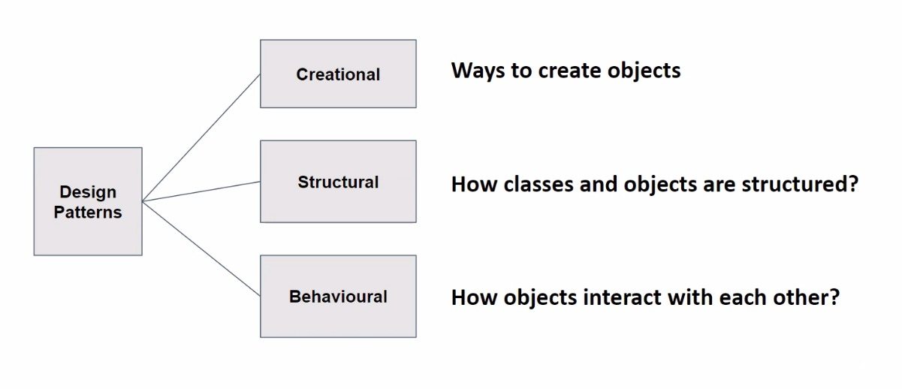
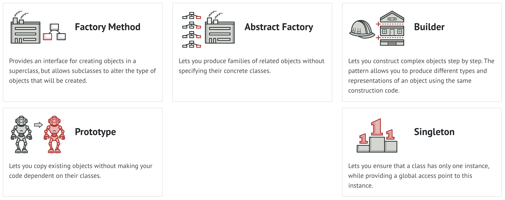
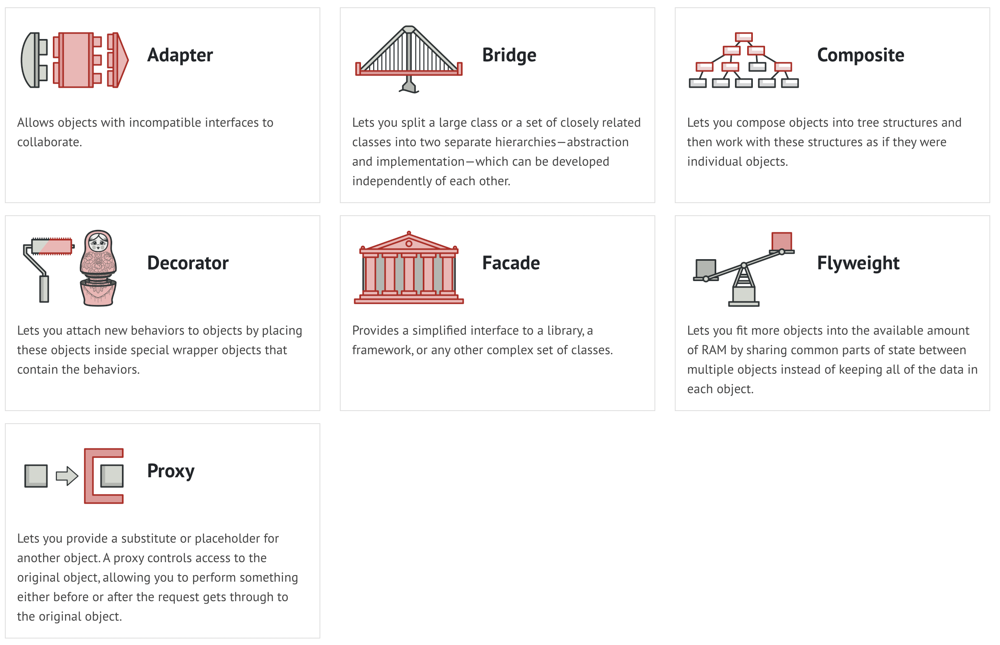
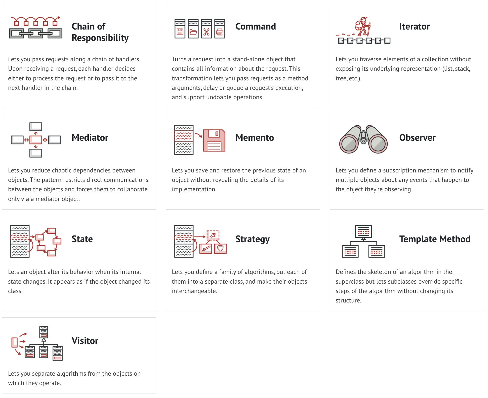
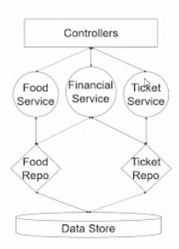
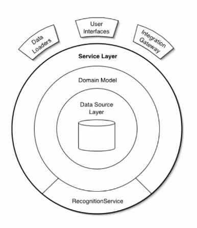

# **SOLID and Design Patterns Principles**

## [SDLC (System Developemnt Life Cycle)](https://www.clouddefense.ai/blog/system-development-life-cycle) - Ways to build good quility software

- Building
- Testing
- Deployment
- Planning
- Defining
- Designing

## What does **Best Practices** give us

Confidence in what you have built and comfort in familiarity of standardization with SOLID and Design Patterns. Unit Tests ensure correct logical implementation.   Keeping code from rotting. Make it durable and maintainable. For our own sanity and keeping a clear mind.

## **Kaizen** - Progressively Improving

___

## Principles vs Patterns

### Design Principle

- Can be thought of as rules.
- Core absttract principles.
- Follow the **Principle** while designing the software.
- Abstract rather than concrete.
- Can be applied to any platform.

### Design Patterns

- Problems that have been solved, instead of reinventing the solution to the problem, apply a pattern.
- Well-proven, and tested by others.

***

## SOLID Principles

- A way of thinking.
- A mindset of mindulness.
- A foundation of quality.

    - S - Single Respnsibility
        - A class, method or piece of code need to do one thing and one thing well.
        - A logical and good separation of concern.
            - *The BadBook class example from Saurahb's example:*
                - seperatng the printing from the class and rather create a printer class.
        - Look for the business rules.
        - Find its domain, and build out.   

         
    - O - Open/Closed Principle
        - A class should be open to extension but closed to modification.
            - *The Guitar example:*
                - Adding a flame style to it, you dont really want to modify the original.
        - Rather implement operations that can be overiden.

             
    - L - Liskov Substitution
        - A class **S** is a subtype of class **T**.
        - Objects of type **T** should be replacable with objects of type **S**.
        - Though desirable functionality shouldn't be lost.
        - Base inputs and outputs should be the same.

         
    - I - Interface Segregation
        - It's better to have many Smaller interfaces, than a few Large interfaces.
        - Seperate the Interfaces functionality.
        - Dont implement interfaces that you wont be using.
        - Only create Abstract classes when you need them.

         
    - D - Dependency Inversion
        - High level modules should not depend on low level modules, both should depend on abstraction.
        - Details depend on abstraction. Abstraction should not depend on details.
            - Loosley coppled
        
         

## How do you find the **balance** with the SOLID Principle

- Can you satisfy all SOLID Principles 100%?
- What guides you towards the right balance?
    - Design Patterns
    - Architecture Patterns

     

## Other Principles that fit nicely with SOLID Principles

- OOP
    - Encapsulation
    - Abstraction
    - Inheritence
    - Polymorphism
    
 - Don't repeat yourself! - Don't copy paste code!

  

 # **Design Patterns FEB 15... continued FEB 16**

 ## What are design patterns?
 - Typical solution to commonly occuring problems in software design.
 - Not an Algorithm
 - Pre-made Blueprints
    - you can see the result
    - you see the features
    - exact order of implementation is up to you

## Gang of Four
- Design Patterns Elements of Reusable Object-Oriented Software

# [What are Creational Design Patterns?](https://refactoring.guru/design-patterns/creational-patterns)

## [Factory Method](https://refactoring.guru/design-patterns/factory-method)

- Provides an interface for creating objects in a superclass, but allows subclasses to alter the type of objects that will be created

    - Example: Blacksmith - Orc or Elvish Blacksmith

## [Abstract Factory](https://refactoring.guru/design-patterns/abstract-factory)

- Allows you to produce families of related pbjects without specifying their concrete classes

    - Example: Creating a Kingdom - Orcish and Elvish have different themes, though they all have a King, Castle, and Army

## [Builder](https://refactoring.guru/design-patterns/builder)

- Allows you to construct complex objects step by step. The Pattern allows you to produce different types of representations of an object using the same construction code.

- A director is required to check if the buidler is following the instructions properly.

    - Example: Character Generated RPG - Allows the definition of specific things of the Character without bloating a constructors parameters.

## [Singleton](https://refactoring.guru/design-patterns/singleton)

- Allows you to ensure that a class has only one instance, while providing a global access point to this instance.

- Provide a global access point to that instance.

    - Example: Ivory Tower of the Wizards - There can only be 1 Ivory tower. It can be used when it's required.

# [What are Structural Design Patterns?](https://refactoring.guru/design-patterns/structural-patterns)

## [Adapter](https://refactoring.guru/design-patterns/adapter)

- Structural deign pattern that allows objects with imcompatible interfaces to collaborate.

    - Example: Celphone Charger Adapters - Youll carray adapter to be able to interact wiht foreign sockets.
    - Example: kph and mph - An adapter to convert from kph to mph or mph to kph.
    
## [Decorator](https://refactoring.guru/design-patterns/decorator)

- Lets you attach new behaviors to objects by placing these objects inside special wrapper objects that contain the behaviors.

    - Example: Decorating a Chirstmas Tree

## [Facade](https://refactoring.guru/design-patterns/facade)

- Provides a simplified interface to a library, a framework, or any other complexset of classes.

    - Example: Things happening in a Car Engine:
        - Separating parts of the engine into other objects, yet only needing to interact with the engine.
        - Running startEngine(), all other operations of other objects start their processes.

## [Proxy](https://refactoring.guru/design-patterns/proxy)

- Proxy is a structural design pattern that lets you provide a substitute or placeholder for another object. A proxy controls access to the original object, allowing you to perform something either before or after the request gets through to the original object.

# [What are Behavoural Design Patterns?](https://refactoring.guru/design-patterns/structural-patterns)

## [Iterator](https://refactoring.guru/design-patterns/iterator)

- Iterator is a behavioral design pattern that lets you traverse elements of a collection without exposing its underlying representation (list, stack, tree, etc.).

    - Allows for looping through structures that have the logic to do so.

## [Observer](https://refactoring.guru/design-patterns/observer)

- Observer is a behavioral design pattern that lets you define a subscription mechanism to notify multiple objects about any events that happen to the object they’re observing.
    - Web knows/should know this one too well.

## [Model View-Controller (MVC)]()

- Model
    - Manage Data.
- View
    - Display the Data.
- Controller
    - Mediate updating the data.
    - Redrawing the display.

## [Service-Layer]()

- Abstraction over domain logic
- Defines application's boundary
    - Layer of services
    - Each Service 
        - Set available operations
        - Response to each operation.

## [Circuit Breaker](https://docs.microsoft.com/en-us/azure/architecture/patterns/circuit-breaker)

- Handle faults that might take a variable amount of time to recover from, when connecting to a remote service or resource. This can improve the stability and resiliency of an application.